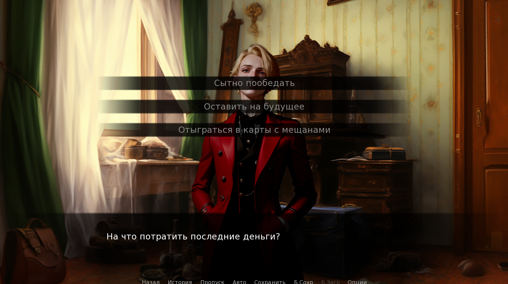
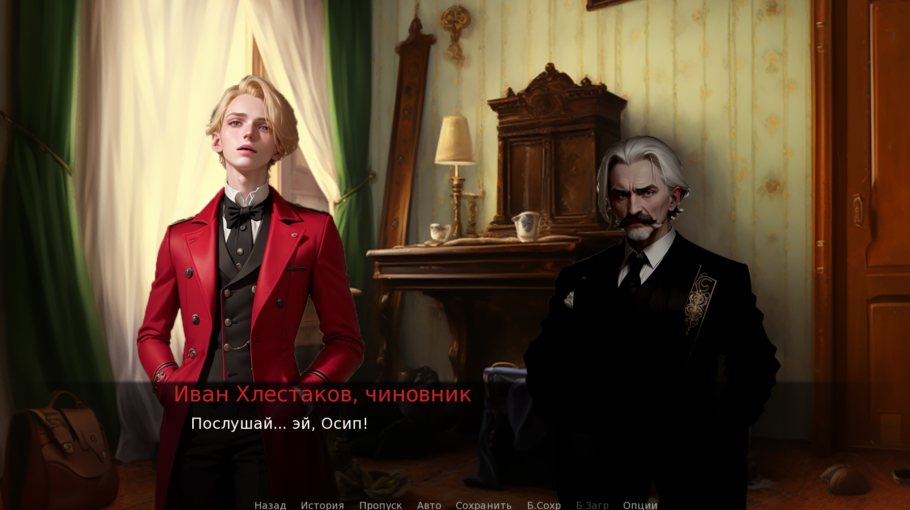

# 🎭 «The Government Inspector» — A Visual Novel Inspired by N.V. Gogol’s Comedy

[](https://github.com/Bit-Maximum/Revizor-The-Game/blob/master/README.md)
[](https://github.com/Bit-Maximum/Revizor-The-Game/blob/master/translation/README.ru.md)

> *«God bless you — but I’m not to blame.» — A classic of Russian satire in the format of a visual novel.*

## 🎮 About the Project

**«The Government Inspector»** — is my first **visual novel**, developed using the **Ren'Py** engine. It is based on the immortal satirical comedy by **Nikolai Vasilyevich Gogol**, reimagined in an interactive format: the player assumes the role of **Alexandrovich Khlestakov** and experiences the key events of this remarkable story.

The project includes:
- an adapted version of the original literary text,
- visual design generated using **Stable Diffusion**,
- support for **мобильные устройства и браузеры**,
- a complete build published on **Itch.io**.

## 🚀 How to Play

You can simply launch the browser version on [Itch.io](https://bit-maximum.itch.io/revizor)

> **Alternatively**: run locally

1. Install [Ren'Py](https://www.renpy.org/latest.html)
2. Download the latest release from the `Releases` section and unpack it into your Ren'Py projects folder:
```bash
git clone https://github.com/Bit-Maximum/Revizor-The-Game.git
```
3. Open the project through the Ren'Py interface and click `Launch Project`

## 📸 Gallery

https://github.com/user-attachments/assets/628b9072-0575-4ed3-bc26-d10f0aa4fe8c

</img> </img> </img> </img>

---

## ✍️ Literary Foundation

- Original work: **«The Government Inspector»**
- Author: **Nikolai V. Gogol**
- Year of writing: **1835**
- Source text: [ilibrary.ru](https://ilibrary.ru/)
- Visual inspiration: the **1952 film adaptation** directed by **Vladimir Petrov**.

## 🖼️ Illustrations & Styling

- 🎨 Character designs and backgrounds were generated using **Stable Diffusion**
- 🎵 Background music: **Kevin MacLeod** (incompetech.com)  
  License: [Creative Commons Attribution 4.0](http://creativecommons.org/licenses/by/4.0/)

## ❤️ Project Goals

This was **my very first video game**. It allowed me to:
- Combine  **literary classics** with **modern technology**
- Learn Ren'Py and the fundamentals of visual novel development
- Experiment with neural networks

---

## 📚 Series: *Russian Classics — A New Format*

> _The Government Inspector is the first entry in a personal series reimagining classic literature._

Design and development: **M.A. Merkurev**  
Project completed and published on Itch.io in 2024.

---
