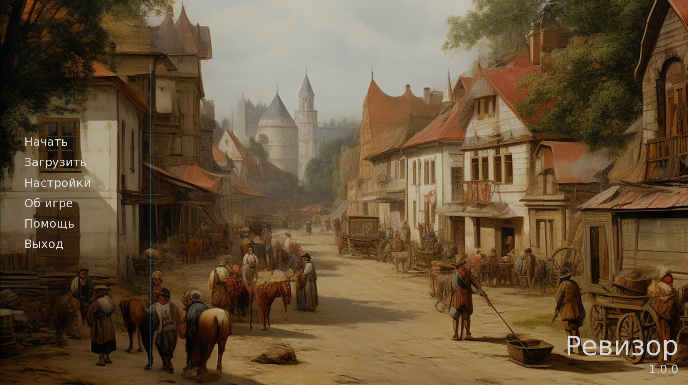
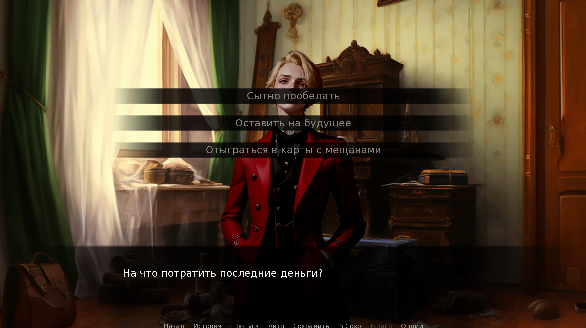
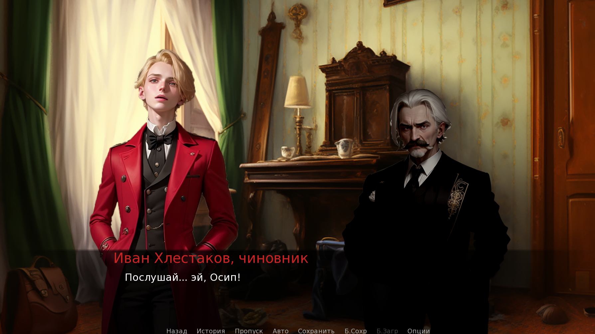
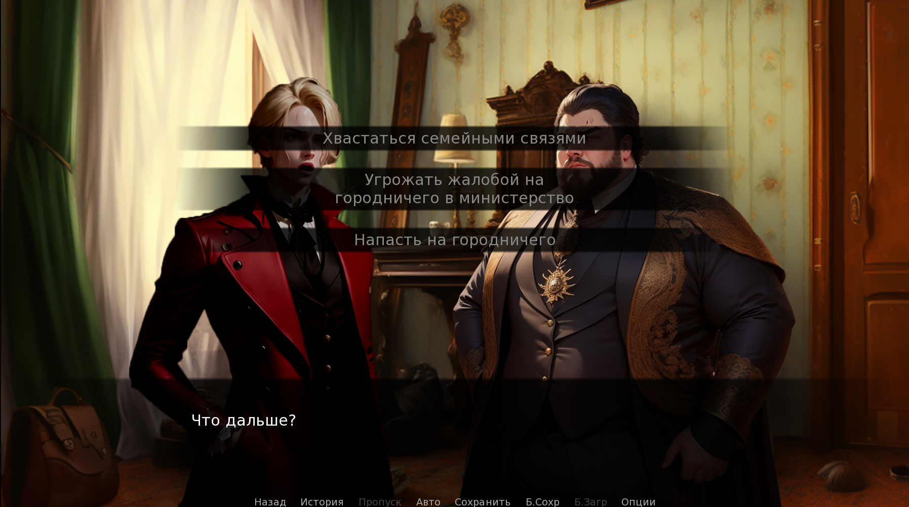

# 🎭 «Ревизор» — визуальная новелла по мотивам комедии Н.В. Гоголя

[](https://github.com/Bit-Maximum/Revizor-The-Game/blob/master/readme.md)
[](https://github.com/Bit-Maximum/Revizor-The-Game/blob/master/translation/README.ru.md)


> *«Да благословит вас бог, а я не виноват.» — классика русской сатиры в формате визуальной новеллы.*

## 🎮 О проекте

**«Ревизор»** — это моя первая **визуальная новелла**, созданная с помощью движка **Ren'Py**. В её основе лежит бессмертная сатирическая комедия **Николая Васильевича Гоголя**, переосмысленная в интерактивном формате: игроку предлагается вжиться в роль **Ивана Александровича Хлестакова** и пройти по ключевым событиям этой удивительной истории.

Проект включает в себя:
- адаптацию классического текста,
- генерацию визуального оформления с помощью **Stable Diffusion**,
- адаптацию под **мобильные устройства и браузеры**,
- создание полноценной сборки и публикации на платформе **Itch.io**.

## 🚀 Как играть

Достаточно запустить браузерную версию на [Itch.io](https://bit-maximum.itch.io/revizor)

> **Альтернатива**: запустить локально

1. Установить [Ren'Py](https://www.renpy.org/latest.html)
2. Скачайте последний релиз проекта в разделе `Releases` и распакуйте архив в папку с проектами Ren'Py:
```bash
git clone https://github.com/Bit-Maximum/Revizor-The-Game.git
```
3. Открыте проект через интерфейс Ren'Py и нажамите `Launch Project`

## 📸 Галерея

https://github.com/user-attachments/assets/628b9072-0575-4ed3-bc26-d10f0aa4fe8c

</img> </img> </img> </img>

---

## ✍️ Литературная основа

- Произведение: **«Ревизор»**
- Автор: **Н.В. Гоголь**
- Год написания: **1835**
- Источник текста: [ilibrary.ru](https://ilibrary.ru/)
- Вдохновением для образов послужила экранизация **1952 года** режиссёра **Владимира Петрова**.

## 🖼️ Иллюстрации и стилизация

- 🎨 Образы персонажей и фоны сгенерированы с использованием **Stable Diffusion**
- 🎵 Музыкальное сопровождение: **Kevin MacLeod** (incompetech.com)  
  Лицензия: [Creative Commons Attribution 4.0](http://creativecommons.org/licenses/by/4.0/)

## ❤️ Цели проета

Этот проект стал **моей первой видеоигрой**. Он позволил:
- Совместить **классику литературы** и **современные технологии**
- Освоить Ren'Py и принципы работы с визуальными новеллами
- Поэкспериментировать с нейросетми

---

## 📚 Серия: *Русская классика — новый формат*

> _«Ревизор» — первая игра в авторской серии переосмысленных классических произведений._

Оформление и дизайн: **М.А. Меркурьев**  
Проект завершён и опубликован на Itch.io в 2024 году.

---


